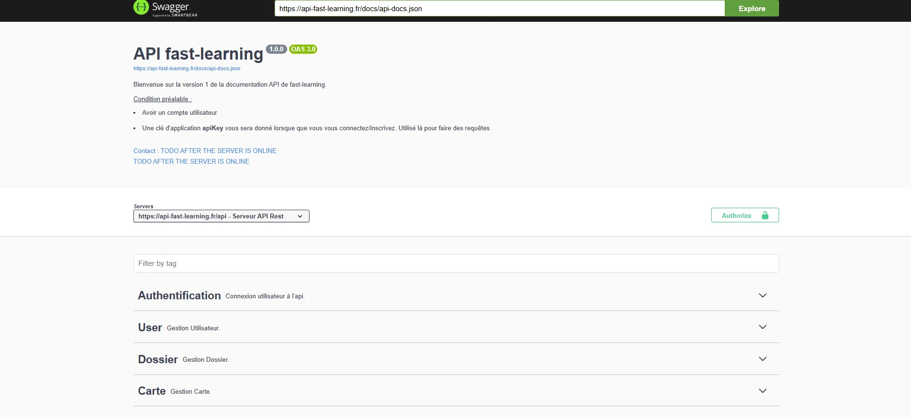

# API FAST LEARNING
Fast Learning est une plateforme éducative innovante. Cette API alimente l'application mobile Fast Learning
Vous trouverez ci-dessous la documentation, les technologies utilisées, et les étapes nécessaires pour configurer et exécuter ce projet.

## Documentation de l'API
La documentation de l'API est disponible sur Swagger. Cliquez sur l'image ci-dessous pour y accéder :

## Les technologies utilisées
- **PHP** et **Laravel**
- **Docker** : via Laravel Sail
- **Swagger** pour documenter l'API

## Les prérequis
- **PHP** >= 8.2 avec les extensions suivantes (`ext-dom`, `ext-xml`, `ext-curl`, `mbstring`, `zip`)
- **Composer** 
- **Docker** et **Docker compose**

## Les instructions d'installation du projet 
- Cloner le projet
- Installer les dépendances : `composer install` `npm install`
- Créer un fichier .env : `cp .env.example .env`
- Générer une clé d'application : `php artisan key:generate` 
- Installer Laravel Sail : `php artisan sail:install`
- Créer un alias pour Sail : `alias sail='sh $([ -f sail ] && echo sail || echo vendor/bin/sail)'`
- Lancer le docker : `sail up -d`
- Migrer la base de données : `sail artisan migrate`

## Les commandes utiles pour travailler 
- sail up -d : pour démarrer les conteneurs
- sail down : pour arrêter les conteneurs
- php artisan migrate : pour exécuter les migrations
- php artisan db:seed : pour exécuter les seeders
- php artisan l5-swagger:generate : pour générer la documentation de l'API
- sail artisan migrate:fresh --seed : pour exécuter les migrations et les seeders

## Un bug trouvé
Si tu trouves un bug dans le code ou dans l'installation de cette application, s'il te plait, contacte moi par mail à cette adresse : guiffaultelian@gmail.com. Merci pour ta contribution.
